##### Step 1. Azure Open AI Resource 만들기
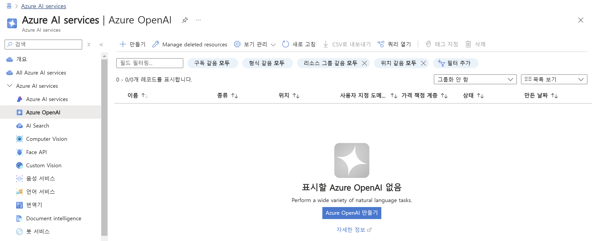

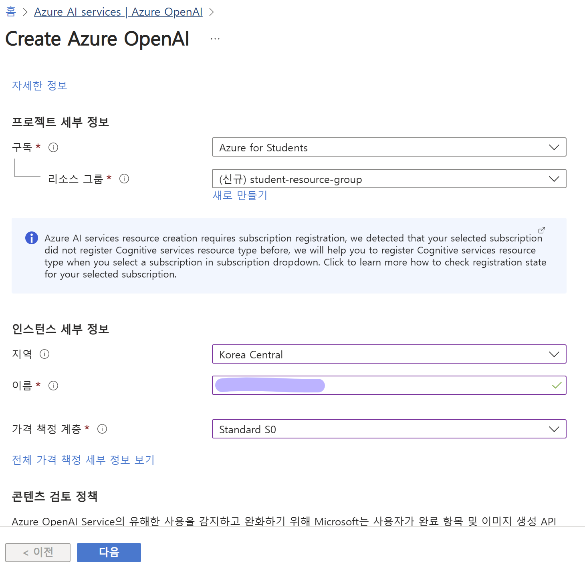

위와 같이 리소스 그룹을 우선적으로 만들어주어야 한다.  
리소스 그룹 이름은 그냥 설정하면 되며,  
인스턴스 세부 정보 - 이름 은 전세계적으로 고유해야 한다.  

현재 학생 구독을 인증받아 student-resource-group 으로 이름을 정했는데,  
추후 리소스 그룹 간 리소스 이동이 가능하다고 하므로, 고민말고 설정해도 될 듯 하다.  

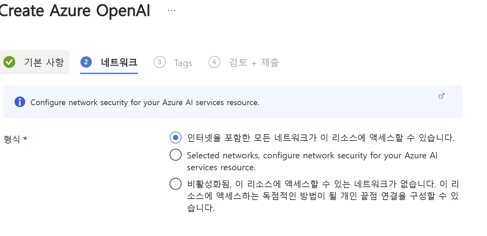
그 다음은 네트워크를 설정한다. api key 가 유출되면 안되므로 selected 를 권장하나,  
카페에서 주로 작업하므로 나는 전체 인터넷으로 선택하였다.

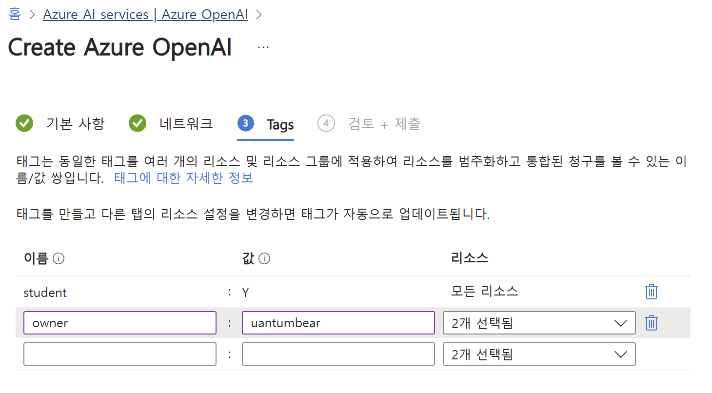
이제 태그를 선택한다.   
나는 student 리소스 구분을 위해 student 태그와
내 닉네임인 uantumbear 를 사용하였다.

다음 단계인 검토+ 제출을 완료하자,  
래와 같은 일정 시간 소요 후, 배포 완료 화면이 나타났다.
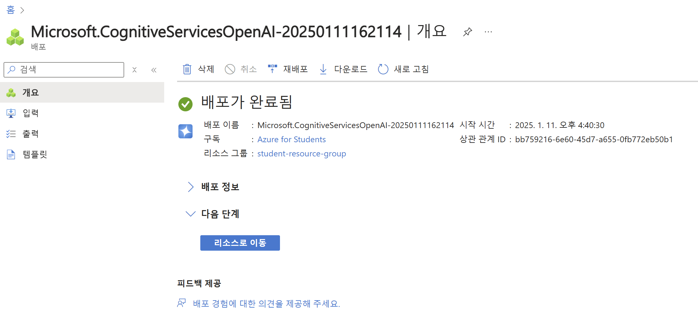
배포 이름은 Azure에서 자동으로 생성한 리소스 이름,  
상관관계ID는 Azure에서 작업 추적을 위해 사용하는 ID 라고 한다.

---

이제 리소스로 이동해보자.  
아래와 같은 화면에서 개발에 필요한 endpoint 와 key 를 볼 수 있다.  
절대 외부로 노출되지 않도록 관리하자.
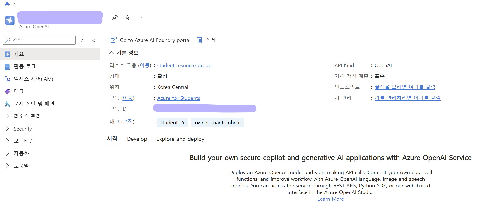


---

Azure Open AI 모델 사용을 위해서는 모델 배포를 해야한다.
먼저 Azure AI Foundry 포털에 로그인을 한다.
https://ai.azure.com/
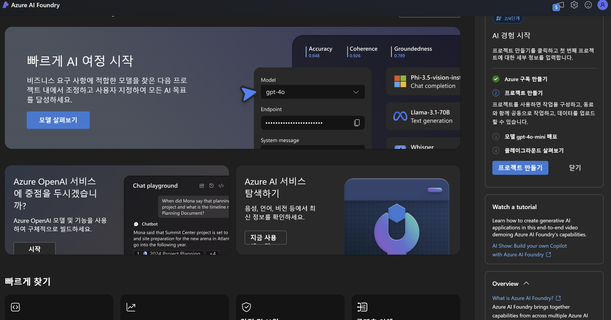

우측 메뉴를 보면, 진행 단계를 확인할 수 있다.  
현재 Azure 구독은 만들었고, 프로젝트 만들기를 해야한다.

만들기를 클릭하면, 프로젝트 이름과 세부 설정이 자동으로 생성되어있다.  
'사용자지정'을 클릭하여, 세부 설정을 변경할 수 있다.

**프로젝트이름**은 언제든지 변경 가능하며,  
구독은 아까 생성했던 student 구독을 사용하면 된다. (해당 창에서는 변경 불가)  
**허브**는 AI 프로젝트 내에서 리소스를 연결하고 조율하는 중심 역할을 하는 서비스라고 한다. 해당 창에서 변경 가능하다.

아래와 같이, 자동 생성되어있던 리소스 그룹과 openAI 리소스 선택창을   
아까 생성했던 **리소스 그룹**과 **openAI 리소스**로 변경해주었다.    
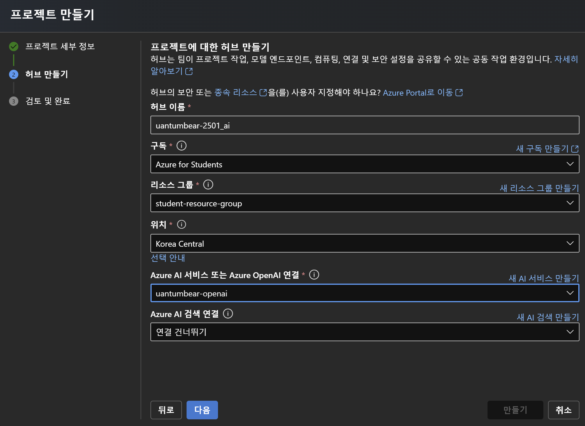

아래와 같이 리소스를 만들고 있다. 꽤 시간 소요된다.
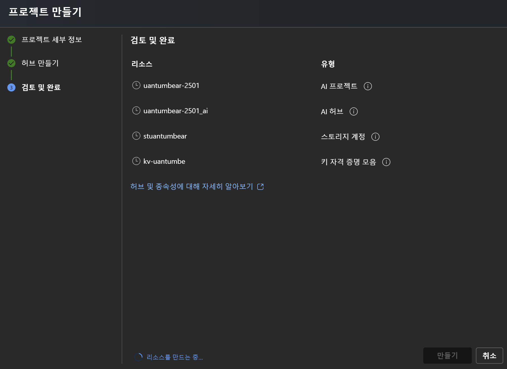

배포가 완료되자 모델 배포 탐색이 가능했다.
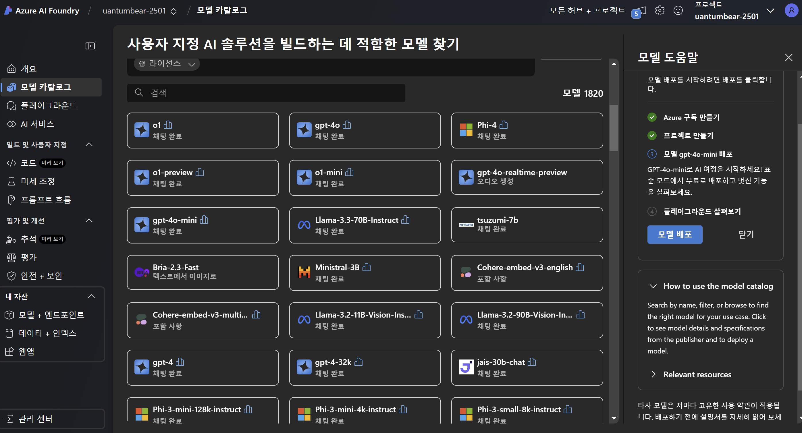
위와 같이 정말 다양한 모델들이 있다.
일단 우측에서 추천하는 gpt-4o-mini 로 배포해보고자 한다.

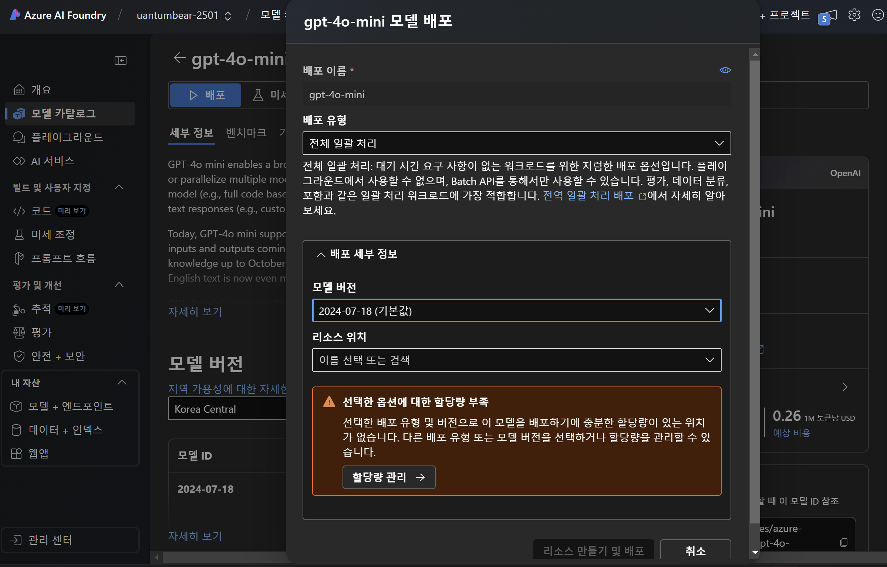
위와 같이 할당량 부족 문제가 떴다.

챗 gpt 에 따르면,
Azure에는 리전별 서비스 제공 정책이 있고, korean central 에는 해당 할당량이 없는 듯 하므로  
East US 지역으로 변경하고 추천했다. 
또한 리소스 그룹의 리전과 모델 리전은 달라고 되지만 비용 절감을 위해서는 리전을 맞추는걸 추천한다고 한다.

---

여기서 잠시, 모델을 배포하기 위한 할당량을 신청하기 전에, 모델을 먼저 알아보자.
##### 배포 유형 알기
일단 배포 유형이라는게 존재한다.  
글로벌 배치, 글로벌 표준, 글로벌 프로비저닝, 기준, 제공됨  
출처: https://learn.microsoft.com/en-us/azure/ai-services/openai/how-to/deployment-types)
일단 프로비저닝과 제공됨 은 월별 혹은 연간 플랜으로 제외하고,  
테스트용으로는 **토큰 수 당 요금을 청구**하는 글로벌 배치, 글로벌 표준, 기준 이 있는데  
**글로벌 표준(Global Standard)** 혹은 **기준(Standard)**을 선택하면 될 듯 하다.

##### 지역별 가용성 알기
그리고 모델 별로 사용할 수 있는 지역이 정해져 있다.  
korea central 을 보면 몇개의 gpt-4o 를 제외하고는 거의 모든 모델의 가용성이 없다.  
따라서 east US 를 사용해야 할 듯 하다.  
출처: https://learn.microsoft.com/en-us/azure/ai-services/openai/quotas-limits#usage-tiers)
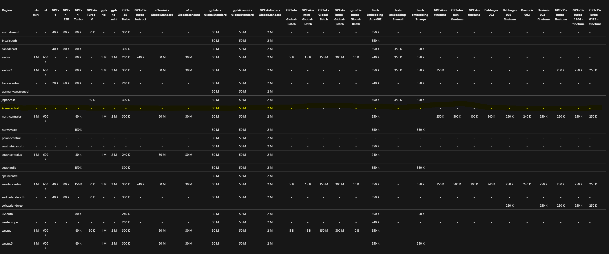

마지막으로 할당량 신청서를 작성하는데, easus 글로벌 표준은 모델 배포를 한국에서 할 수 없었다.  
최종적으로 'Standard' 를 선택했고,
azure ai servicer - openai 의 구독ID 와  
gpt-35-turbo (할당량100) 으로 신청을 하였는데.. 일단 승인을 기다려봐야 한다.

찾아보다 보니 애초에 기업용을 위해 만든 서비스 같아서 사용 가능할 지 모르겠다..
2영업일이 소요된다고 하니 기다려보겠다.


##### Azure Open AI 모델 배포하기
한 일주일이 지난 후 할당량을 허가받았다!
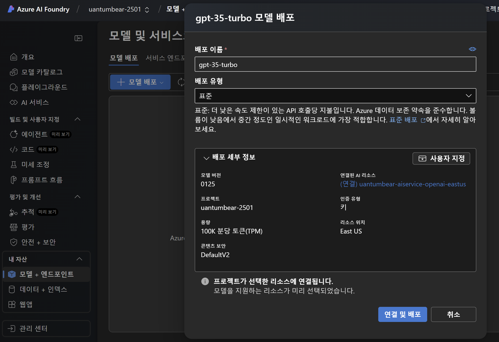

할당량을 허가 받자 아래와 같이 배포가 가능해졌다.

하지만 배포 퍼튼을 클릭하자,
아래와 같은 메시지를 받았다.
```text

gpt-35-turbo 모델을 배포하지 못했습니다.
ValidationError: The workspace MSI does not have deployments/write permissions to the underlying resource with id /subscriptions/c02ba630-04de-41c0-9255-7a3811fa9711/resourceGroups/student-resource-group-eastus/providers/Microsoft.CognitiveServices/accounts/uantumbear-aiservice-openai-eastus. Please ensure you have the proper permissions and try again.
추적 ID : b52c9d1c-50ad-44c7-b9f2-5e115fe09c36
클라이언트 요청 ID : e0f89fe8-a677-47e7-bc81-e6f44e15618e
서비스 요청 ID : 15d50383-5755-4ac8-b550-5b43727eeea9
```

이는 MSI(Managed Service Identity)가 배포(write) 권한이 없다는 의미라고 한다..
해결방법:
(1) Azure Cognitive Services
uantumbear-aiservice-openai-eastus 리소스 의 액세스제어 (IAM) 화면에서,
"역할 할당 추가" (이 리소스에 액세스 권한 부여) 클릭
Cognitive Services OpenAI Contributor 를 클릭 후 '다음' 버튼 클릭
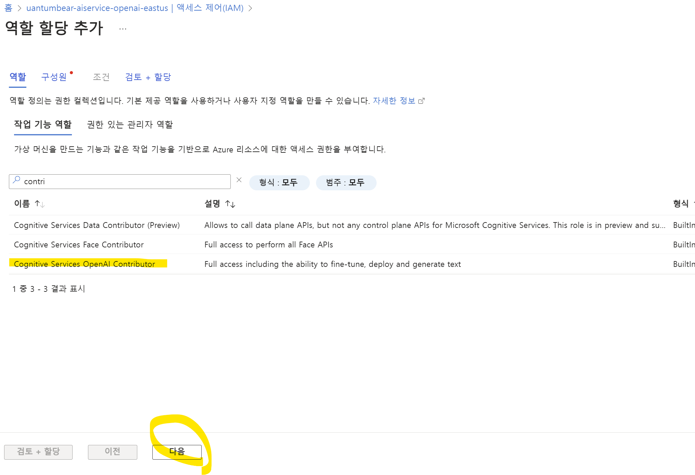
그리고 내 계정을 선택 후.. 검토+할당을 클릭하고 진행했다..
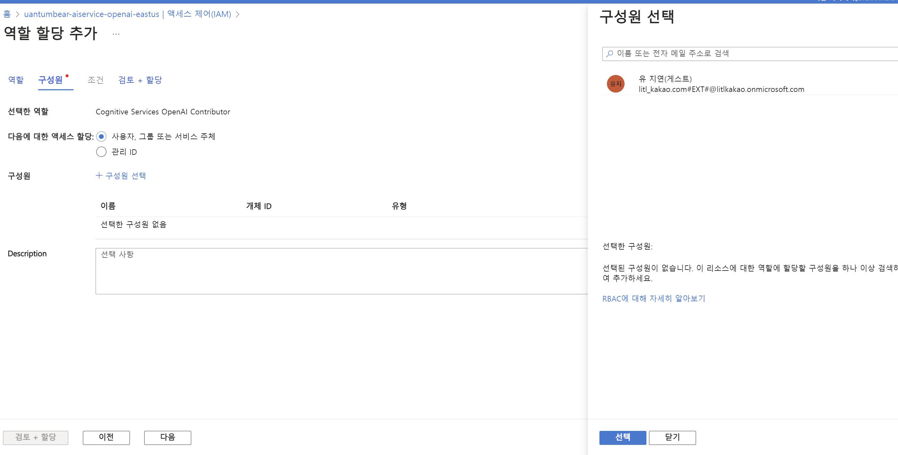

그리고 다시 Azure AI Foundry 로 돌아가서 다시
모델 배포를 클릭하자 모델 배포가 진행되었다!!

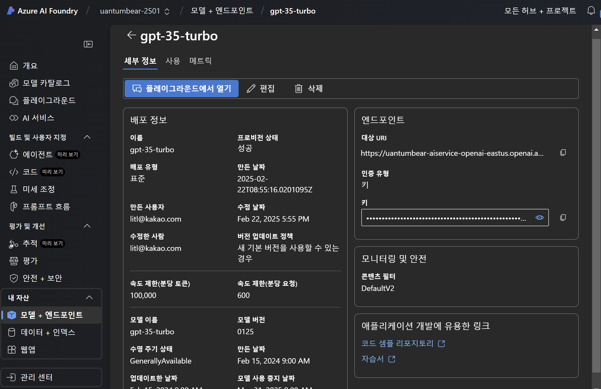
