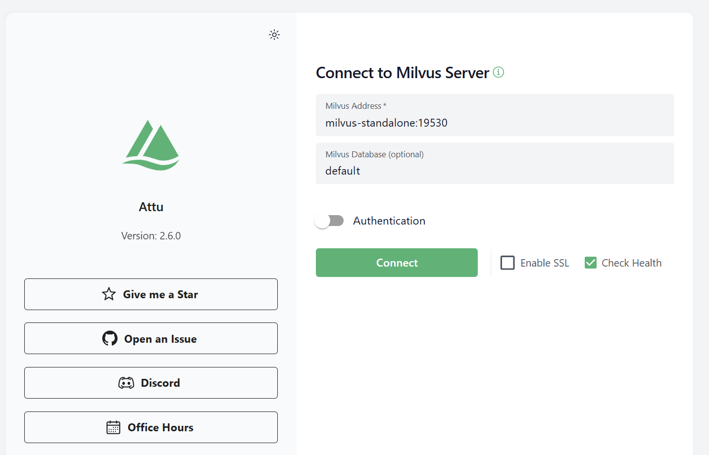

# Milvus 사용하기

##### 1. Docker Desktop 실행

##### 2. Milvus 오픈소스 다운받기

```powershell
# VSCode 파워쉘 터미널에서 

git clone https://github.com/milvus-io/milvus.git
cd milvus/deployments/docker/standalone

docker compose up -d
```

※ 상태 확인하기

```powershell 
docker compose ps 
```
참고로, `docker compose ps` 명령어는 현재 디렉토리에 있는 docker-compose.yml 파일을 기준으로 상태를 보여준다.  

```powershell 
# 결과
 PS C:\Users\litl\PycharmProjects\gitProject\StudyDev\FY2025LLM\milvus\milvus\deployments\docker\standalone> docker compose ps   
>> time="2025-09-13T12:04:50+09:00" level=warning msg="C:\\Users\\litl\\PycharmProjects\\gitProject\\StudyDev\\FY2025LLM\\milvus\\milvus\\deployments\\docker\\standalone\\docker-compose.yml: `version` is obsolete"
>> NAME                IMAGE                                      COMMAND                   SERVICE
>>       CREATED          STATUS                    PORTS
>> milvus-etcd         quay.io/coreos/etcd:v3.5.18                "etcd -advertise-cli…"   etcd 
        13 minutes ago   Up 13 minutes (healthy)   2379-2380/tcp
>> milvus-minio        minio/minio:RELEASE.2024-05-28T17-19-04Z   "/usr/bin/docker-ent…"   minio
        13 minutes ago   Up 13 minutes (healthy)   0.0.0.0:9000-9001->9000-9001/tcp
>> milvus-standalone   milvusdb/milvus:v2.6.1                     "/tini -- milvus run…"   standalone   13 minutes ago   Up 13 minutes (healthy)   0.0.0.0:9091->9091/tcp, 0.0.0.0:19530->19530/tcp
```
결과를 보면,  
- milvus-etcd
- milvus-minio
- milvus-standalone  

세 개의 컨테이너가 모두 Up (healthy) 상태,  즉 Milvus가 필요한 모든 컴포넌트를 정상 구동 완료한 것이 보인다.  

19530/tcp → gRPC 연결용 (SDK, Python 클라이언트에서 사용)  
9091/tcp → REST API 연결용 (HTTP 호출로 확인 가능)  


<br>
<br>
<br>


# Tool 사용하기 (Attu)
```powershell
[SUCCESS]
docker run -d --name attu `
  --network milvus `
  -p 3000:3000 `
  -e MILVUS_URL=http://milvus-standalone:9091 `
  zilliz/attu:latest

# localhost:3000 에서 다시 접속한 결과
실패한 주소: http://milvus-standalone:9091 / default
[ERROR]
Received RST_STREAM with code 2 triggered by internal client error: Protocol error (retried 3 times, 178ms) 
```
###### 최종적으로 연결 가능한 주소


`docker run` : 새로운 컨테이너(프로그램 실행 환경)를 만들어 실행한다. 로컬에 이미지가 없으면 자동으로 Docker Hub 에서 다운받는다.  
`3000:3000` : 포트 매핑, host:Container. 즉, 로컬 포트 3000을 컨테이너 안의 웹 서버 Attu 3000포트로 연결한다.  
`-e MILVUS_URL=http://host.docker.internal:9091` : “Milvus REST API 주소는 이거야” 라고 환경변수를 설정한다.  
-> 참고로 9091은 Milvus의 REST 포트이다. Attue 는 REST 로 Milvus 에 붙는다.  
-> gRPC 는 19530

---

<br>
<br>
<br>


# gRPC 란?
google 에서 만든 고성능 통신 프로토콜 (Google Remote Procedure Call) 이다.  
Milvus, Elasticsearch, Redis 등 최신 분산 시스템에서 많이 사용하며,  
Python, Go, Java 등 여러 언어에서 같은 규격으로 쉽게 호출가능하다.  

`※` Milvus에서 두가지 포트 역할  

| 프로토콜 | 기본 포트 | 용도 |
|-------|-------|-------|
| gRPC | 19530 | 애플리케이션이 Milvus와 직접 통신할 때 사용 (벡터 insert, search, delete 등 대부분) |
| REST API | 9091 | 웹 기반 툴(Attu)이나 간단한 헬스체크용 |

즉, 파이썬 코딩으로 pymilvus 를 사용할 때에는 19530으로, Attu 웹 UI 툴에서는 9091로 접근하면 된다.  


###### 연결이 안되어 체크한 사항들
```powershell
[FAIL]
docker run -p 3000:3000 -e MILVUS_URL=http://host.docker.internal:9091 zilliz/attu:latest
# 위 방식은 Attu → Host → Milvus 로 호스트 네트워크를 경유하는 방식
# 도커의 기본 브리지 네트워크(bridge) 에 Attu 컨테이너가 붙는다.
# host.docker.internal 은 "호스트(윈도우) 네트워크"를 가리키는 특별한 DNS 이름이다.
# 윈도우/맥에선 대부분 되지만, 환경 따라 해석이 안 되거나 방화벽/라우팅 문제로 실패할 수 있다.
```

※ 헬스 체크
```browser
http://localhost:9091/healthz
# 응답: OK
```
※ 네트워크 이름 확인  
http://localhost:3000/#/connect 에서  
Milvus Address : http://host.docker.internal:9091/default
Milvus Database : default 로 하자 Network Error 가 났다.  
Attu 컨테이너 → Milvus로 가는 경로에서 막히는 상황.  
```powershell
docker network ls

(venv312) PS C:\Users\litl\PycharmProjects\gitProject\StudyDev\FY2025LLM> docker network ls
NETWORK ID     NAME                              DRIVER    SCOPE
fd9606510d2d   bridge                            bridge    local
37a827f1092c   host                              host      local
d6afd4d087f7   kyobo-open-webui-master_default   bridge    local
151852ee9e3b   milvus                            bridge    local
54ed391d1255   none                              null      local

# milvus 가 보인다.

docker inspect milvus-standalone --format '{{json .NetworkSettings.Networks}}'

# docker inspect [container_name] : 해당 컨테이너의 상세 정보를 JSON 형태로 본다
# --format '{{json .NetworkSettings.Networks}}' : 그 중에서 네트워크 정보만 뽑아서 보겠다. 

# 결과:
{"milvus":{
  "Aliases":["milvus-standalone","standalone"],
  "Gateway":"172.18.0.1",
  "IPAddress":"172.18.0.4",
  "DNSNames":["milvus-standalone","standalone","204a921a9cf8"]
}}
```
- 네트워크 이름: milvus
- 컨테이너 이름(alias): milvus-standalone
- 컨테이너 내부 IP: 172.18.0.4
- 게이트웨이: 172.18.0.1 (네트워크 라우터 역할)
->
milvus-standalone 라는 Container는 mulvus 라는 Docker Network 안에 있고,  
같은 네트워크 안에서는 milvus-standalone:9091 라는 주소로 접근할 수 있다. 
고 하는데.. 접속이 안되어서 보니 Milvus 네트워크로 띄워 보라고 한다.


